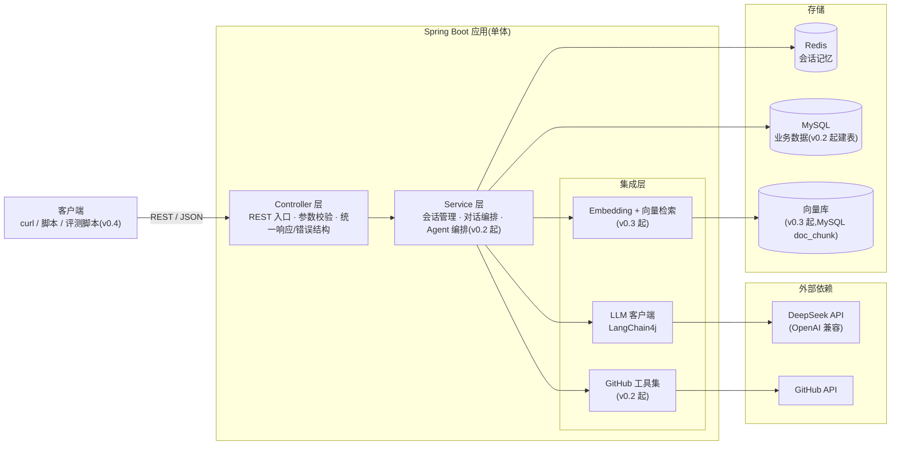
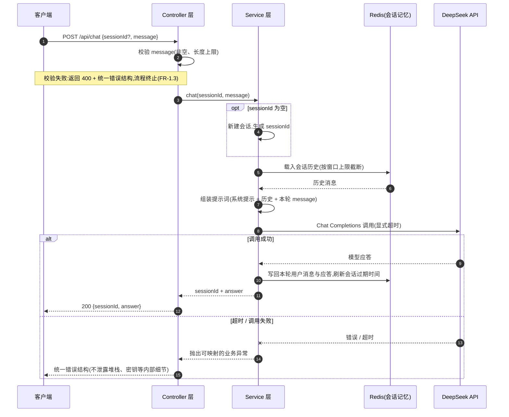

# repo-scout 概要设计文档

> 本文档为设计基线,随实现迭代更新。

- 版本:v0.3(v0.3 RAG 检索接入对话与仓库导读报告落地)
- 日期:2026-07-26
- 状态:待评审
- 关联文档:[需求文档 requirements.md](requirements.md)

---

## 1. 概述

### 1.1 文档目的

本文档描述 repo-scout(GitHub 仓库导读 Agent)的总体架构、模块划分、关键数据流、存储设计与技术选型理由,作为 v0.1–v0.4 各迭代开发的设计基线:

- 固化跨迭代稳定的架构决策,让每期开发在同一张蓝图上做增量;
- 为当前迭代 v0.1 提供可直接对照开发的分层职责与数据流说明;
- 记录技术选型的取舍理由。

实现细节(具体包名、类名、Redis 键名格式等)不在本文约束范围内,由实现时确定;文中尚无法确定的决策一律标注「待定」,不提前拍板。

### 1.2 读者

- 本项目开发者(含并行开发骨架代码的协作方):按本文的分层与职责落地代码;
- 架构评审人:检查设计与需求的一致性;
- 学习 Spring Boot 3 + LangChain4j 构建 Agent/RAG 应用的工程师(见需求文档「给谁用」)。

### 1.3 与需求文档的关系

- [requirements.md](requirements.md) 回答「做什么」:按 FR 编号定义功能需求,按 v0.1–v0.4 划分迭代。本文回答「怎么做」,全程引用 FR 编号,不重复需求内容。
- 需求文档的非功能需求(超时、成本、错误处理、安全)在本文第 7 节收敛为设计约束。
- 两文档如有矛盾,以 requirements.md 为准,并应尽快修订本文消除矛盾。

---

## 2. 架构总览

### 2.1 目标架构(v0.4 完整形态)

repo-scout 是单体 Spring Boot 应用,对外只暴露 REST API(一期无前端)。应用内部分三层:Controller 层负责协议与校验,Service 层负责会话管理与编排,集成层封装对大模型、GitHub 与向量检索的访问。外部依赖为 DeepSeek API 与 GitHub API;存储按职责分离:MySQL 存业务数据、Redis 存会话记忆、向量库存文档向量。



图中标注版本的组件在对应迭代才引入;未标注版本的部分自 v0.1 起存在。

### 2.2 演进说明

各迭代在同一架构上做增量,不推翻前期结构:

| 迭代 | 新增内容 | 架构上的变化 | 对应 FR |
| --- | --- | --- | --- |
| v0.1 | 项目骨架、DeepSeek 接入、基础对话 API、会话记忆 | 只有「对话链路 + Redis 记忆」:Controller → Service → LLM 客户端 → DeepSeek,记忆读写 Redis;MySQL 仅配置连接、不建表 | FR-1.1 ~ FR-1.4 |
| v0.2 | 仓库接入、GitHub 工具集、Agent 自主规划(Function Calling) | 新增 tools 模块与 GitHub API 依赖;MySQL 开始存仓库记录;Service 层扩展出 Agent 编排 | FR-2.1 ~ FR-2.3 |
| v0.3 | 文档向量化、RAG 问答、仓库分析报告 | 新增 rag 模块、进程内 Embedding(`bge-small-zh`)与向量库 | FR-3.1 ~ FR-3.3 |
| v0.4 | 效果评估、Docker 部署、文档收尾 | 应用架构不变;新增独立 Python 评测脚本(作为 API 客户端)与 Docker/Compose 交付物 | FR-4.1 ~ FR-4.3 |

---

## 3. 模块划分与分层职责

以下为逻辑模块划分:v0.1 模块写到职责粒度,v0.2/v0.3 模块只给概要,进入对应迭代前再细化。具体包名、类名以骨架代码实现为准,本文不做约束。

### 3.1 controller(v0.1,详)

- REST 入口:承接 `GET /api/health`(FR-1.1)、`POST /api/chat`(FR-1.3)等接口,只做协议转换,不含业务逻辑。
- 参数校验:`message` 非空、长度上限(FR-1.3;长度上限同时服务于成本控制约束),校验失败返回 400 与可读错误信息。
- 统一响应/错误结构:对外统一「错误码 + 人类可读信息」的错误响应,按错误类别映射 HTTP 状态码(参数错误 4xx、外部依赖失败、内部错误 5xx),不向客户端泄露堆栈与密钥(FR-1.3,错误处理原则)。

### 3.2 service(v0.1,详)

- 会话管理:`sessionId` 为空时新建会话并在响应中返回;会话彼此隔离,上下文互不串扰(FR-1.3、FR-1.4)。
- 对话编排:载入记忆 → 组装提示词 → 调用模型 → 写回记忆的主流程(FR-1.2 ~ FR-1.4,详见第 4 节)。

### 3.3 config(v0.1,详)

- 数据源装配:MySQL 连接配置(v0.1 仅连接,不建表)。
- Redis 装配:连接配置与会话记忆参数(窗口上限、过期时间,均可配置,FR-1.4)。
- LangChain4j 模型客户端装配:DeepSeek base-url、模型名、超时等均可配置(FR-1.2);API Key 等敏感配置仅通过环境变量注入(FR-1.1,安全约束)。

### 3.4 tools 与 GitHub 集成(v0.2,详)

#### 3.4.1 GitHub 访问共用基建

- `GithubApiClient`(集成层,Spring `RestClient` 实现):GitHub API 的唯一出口,仓库接入服务(FR-2.1)与四个工具(FR-2.2)共用。**只暴露通用方法,不含业务语义**:
  - `JsonNode getJson(String path, Map<String, ?> queryParams)`
  - `String getRaw(String path, String acceptHeader)`(取 README 原文用,如 `application/vnd.github.raw+json`)
- 配置 `app.github.*`:`base-url`(默认 `https://api.github.com`)、`token`(默认空,由环境变量 `GITHUB_TOKEN` 注入,非空则带 `Authorization: Bearer`)、`timeout`(连接与读超时,默认 10s)。请求固定携带 `User-Agent: repo-scout` 与 `X-GitHub-Api-Version` 头。
- 统一错误映射(client 内抛专用异常,由全局异常处理器映射为统一错误结构):

  | GitHub 响应 | 重试 | 异常 | 对外映射 |
  | --- | --- | --- | --- |
  | 404 | 不重试 | `RepoNotFoundException` | 404 `REPO_NOT_FOUND` |
  | 403/429 且具限流特征(`X-RateLimit-Remaining: 0` 或响应 message 含 rate limit) | 不重试 | `GithubRateLimitException` | 502 `GITHUB_UNAVAILABLE`(message 明示限流) |
  | 网络错误/超时/5xx | 固定间隔 500ms 重试 1 次 | 仍失败抛 `GithubUnavailableException` | 502 `GITHUB_UNAVAILABLE` |

  失败记 WARN 日志(path、状态码),不得记录 token。
- `RepoRef`:record `(owner, name, defaultBranch)`,仓库标识,owner/name 为 GitHub 规范大小写,供工具层使用。
- `ToolsProperties`(`app.tools.*`):工具裁剪配置,默认 `tree-max-depth=3`、`tree-max-entries=200`、`readme-max-chars=8000`、`issues-max=20`、`commits-max=20`;v0.2 契约期固化默认值,工具实现期只读。
- 仓库接入服务(FR-2.1)基于 `getJson("/repos/{owner}/{name}")` 解析元信息;幂等落库用 `findByOwnerAndName` 查重,并发唯一键冲突捕获 `DataIntegrityViolationException` 后重查更新兜底。

#### 3.4.2 四个 GitHub 工具契约(FR-2.2,实现于后续任务)

- 形态:`GithubTreeTool` / `GithubReadmeTool` / `GithubIssuesTool` / `GithubCommitsTool` 四个独立类(tools 包)。**非单例 bean**:按仓库实例化,构造注入 `(GithubApiClient, ToolsProperties, RepoRef)`;方法实现期加 LangChain4j `@Tool` 注解,方法参数只含模型可见参数——repoId 一律不进模型参数,由构造时的 RepoRef 决定访问哪个仓库。
- 签名与行为:

1. `String repoTree(Integer maxDepth)`:`GET /repos/{owner}/{name}/git/trees/{defaultBranch}?recursive=1`;maxDepth 空用默认值、上限受 `tree-max-depth` 约束;输出缩进树形文本,目录带 `/` 后缀;条目按路径段逐段字典序排序(同层兄弟字典序、不做目录优先,子项紧跟父目录),不用纯 path 字符串字典序以免 `-`(45) < `/`(47) 把同名目录的子项拆到 `xxx-yyy` 之后;条目超 `tree-max-entries` 截断并加尾注;GitHub 返回 `truncated=true` 同样注明。输出模板:

   ```text
   src/
     main/
       java/
         RepoScoutApplication.java
   README.md
   (已截断:共 340 项,显示前 200 项)
   ```

2. `String readme()`:`GET /repos/{owner}/{name}/readme`(Accept `application/vnd.github.raw+json`);超 `readme-max-chars` 截断加尾注;404 返回文本「该仓库没有 README」,不抛异常。输出模板:

   ```text
   # 项目名
   项目介绍正文……
   (已截断:原文 12000 字符,显示前 8000 字符)
   ```

3. `String issues(String state)`:state ∈ `open|closed|all`(非法值按 open);`per_page` = `issues-max`;**必须过滤掉含 `pull_request` 字段的条目**(该端点混含 PR,已知坑);空结果返回「无符合条件的 issue」。输出模板(每行一条):

   ```text
   #42 [open] 登录超时后会话未清理(更新于 2026-07-20;标签 bug,auth)
   #38 [open] 支持自定义端口(更新于 2026-07-18;标签 enhancement)
   ```

4. `String recentCommits(Integer limit)`:limit 空用默认值、上限 `commits-max`。输出模板(每行一条):

   ```text
   a1b2c3d 2026-07-25 alice: fix: 修复会话过期时间未刷新
   9e8f7a6 2026-07-24 bob: feat: 新增仓库接入接口
   ```

- 错误策略(四工具一致):捕获 GitHub 异常,**返回一行可读文本**(如「GitHub API 限流,请稍后重试」),不向上抛,保证工具失败不中断对话;详情进 WARN 日志。

#### 3.4.3 Agent 编排(FR-2.3,v0.2)

将四个工具接入对话链路,由 Agent 自主规划调用。关键决策:

- **单例 AiServices + ToolProvider(工具挂载)**:`Assistant` 为单例 `AiServices`,工具集不在装配期固定,而是由 `ToolProvider` 按 `chatMemoryId`(即 sessionId)动态决定——未绑定仓库返回空工具集(退化为 v0.1 纯对话),已绑定则查 repo 记录构造 `RepoRef`,按仓库实例化四个工具并挂载。repoId 由服务端从绑定关系解析,不进入模型可见的工具参数。
- **系统提示词按绑定态切换**:用 `systemMessageProvider` 而非 `@SystemMessage` 注解(注解优先级高于 provider,会屏蔽动态切换)——未绑定沿用纯对话提示;已绑定改用「可调用工具取实时数据、优先基于真实数据作答、取不到不编造」的提示。
- **会话-仓库绑定存储**:每会话一个 Redis STRING 键 `repo-scout:chat:repo:{sessionId}`,值为 repoId;与会话记忆**同 TTL**(复用 `app.chat.memory.ttl`),每轮对话刷新,过期后需重新携带 repoId 绑定。绑定三态(首绑校验存在性→404、冲突→400、同/不传→沿用)在对话服务内校验。独立小类封装,不与会话记忆存储混用。
- **轮数上限与轨迹日志**:单次问答工具调用轮数上限由 `app.agent.max-tool-rounds`(默认 5,`AGENT_MAX_TOOL_ROUNDS`)控制。实现用包装 `ToolExecutor` 计数:达到上限后不再执行真实工具,返回一行可读文本让模型基于已有信息收尾(优雅、可读、不死循环),而非依赖框架 `maxSequentialToolsInvocations`(该参数超限即抛异常,无法「让模型收尾」,仅作防跑飞硬兜底,取值高于业务上限)。同一包装器按 INFO 级记录调用轨迹(sessionId、工具名、参数摘要 ≤200 字符、耗时、结果长度);**用户消息全文与工具完整返回不进 INFO**。

### 3.5 rag(v0.3)

v0.3 分两步落地:先交付 **FR-3.1 向量化入库管道**,再交付 **FR-3.2 检索接入对话与来源引用、FR-3.3 仓库导读报告**(设计基线见 3.5.1)。

管道分四段,由 `IndexingService` 同步编排(个人项目,受拉取上限约束,耗时可接受),触发端点见下:

1. **文档拉取(`DocumentFetcher`)**:复用 `GithubApiClient`(只消费 `getJson`/`getRaw`,不改其行为)。范围**硬编码**——README(`/repos/{o}/{n}/readme`,raw)+ `docs/` 目录下扩展名白名单文件(`.md/.markdown/.txt/.adoc/.rst`,经递归目录树解析 blob 路径过滤)。上限:最多 `app.rag.max-files` 个文件(README 计入,超出按路径字典序截断),单文件超 `app.rag.max-file-bytes` 跳过。失败策略:README 或单个 docs 文件拉取失败记 WARN 跳过(尽量索引其余);**目录树整体拉取失败**则抛 `GithubUnavailableException`/`GithubRateLimitException`,由端点映射 502。
2. **切分(`DocumentChunker`)**:用 langchain4j `DocumentSplitters.recursive(chunkSize, chunkOverlap)`(字符版)按 `app.rag.chunk-size`(默认 400)/`chunk-overlap`(默认 80)切分,保留 `file_path` 与文件内递增 `chunk_index`。chunk 取偏小:bge 输入上限 512 token、中文单字常 >1 token,过大易在向量化时截断丢信息。
3. **向量化(`bge-small-zh` 量化模型)**:进程内 ONNX 推理(`BgeSmallZhQuantizedEmbeddingModel`,自带权重、无外网),`embedAll` 批量向量化;输出维度 512,不硬编码进表结构。
4. **入库(`RepoVectorStore` 抽象)**:`replaceRepoChunks` **先删该 repo 旧块再批量插**(同一事务),天然幂等——重复索引不产生重复数据(唯一键 `(repo_id, file_path, chunk_index)` 兜底)。`search(repoId, queryVector, topK)` 加载单仓库全部块(百级规模)在进程内算**余弦相似度**、降序取 topK,由 FR-3.2/FR-3.3 消费(见下)。

#### 3.5.1 检索接入对话与仓库导读报告(FR-3.2/FR-3.3)

把 FR-3.1 的检索能力接入对话链路,并新增导读报告端点。关键决策:

- **双引擎协同**:检索注入(文档语义)与 v0.2 工具调用(实时结构化数据)并存——绑定会话的系统提示词指引模型「优先依据注入的文档摘录作答并注明来源;需要实时/结构化数据时用工具;两者都取不到依据时如实说明,不编造」。
- **检索注入走 langchain4j RAG 抽象**:自定义 `ContentRetriever`(`ChatContentRetriever`,从 query metadata 取 chatMemoryId 查会话绑定,未绑定返回空、零成本)+ 自定义 `ContentInjector`(`ChatContentInjector`,空命中原样返回原消息、零改写,保证 v0.1/v0.2 行为零回归;非空则在原用户消息后追加带来源路径的摘录区),用 `DefaultRetrievalAugmentor` 组装挂到单例 AiServices——与「ToolProvider 动态挂载」同一套框架机制,注入按会话动态生效。
- **检索核心复用**:`RepoRetriever` 供 chat 与 report 共用,顺序固定:未建索引(`existsByRepoId` 为 false)直接空返回、**不触碰 EmbeddingModel**(CI 不加载 ONNX 模型、未索引仓库优雅降级的关键);查询侧 embed 前拼接 bge 官方查询指令前缀(文档入库侧不加);检索后按 `min-score`(余弦相似度阈值,默认 0.5,`RAG_MIN_SCORE`)过滤,条数由 `top-k`(默认 4,`RAG_TOP_K`)控制。EmbeddingModel 注入点与 IndexingService 同款 `@Lazy`。
- **`sources` 字段**:`POST /api/chat` 响应新增 `sources`(string[]),从 `Result.sources()` 提取本轮**实际注入**的检索来源文件路径,去重、保持检索得分降序;未绑定/未索引/无命中为 `[]`,永不为 null。答案内文的出处标注给人读,`sources` 给程序用(v0.4 评测直接消费)。
- **报告确定性取数 + 单次 LLM 调用**:`POST /api/repos/{id}/report` 由 `ReportService` 同步生成,**不经过 Assistant/会话/记忆**(一次性任务不需要记忆;确定性取数成本可控、可测试)——服务端直接实例化四个 GitHub 工具按默认参数取数(复用工具内置裁剪与失败降级文本,GitHub 故障不产生 502),加上 `RepoRetriever` 对固定查询集(定位/上手/架构)的摘录(按 `(filePath, chunkIndex)` 去重合并),拼成单条消息交 LLM 输出五个固定二级标题的 Markdown(项目定位/技术栈/目录结构解读/上手指引/近期动向)。服务端校验五节齐全且非空,不合规追加纠正指令重试一次,仍不合规照常返回并记 WARN。
- **未索引降级,不自动索引**:绑定会话未建索引时 chat 退化为纯工具模式(`sources=[]`),report 摘录区标注未索引;**不做**绑定时/报告前自动索引——对话延迟可控、不隐式放大 GitHub 调用、索引保持显式生命周期步骤(v0.4 评测可复现)。建议先 `POST /api/repos/{id}/index` 再问答/生成报告。

---

## 4. 关键数据流:v0.1 一次对话请求

对应 FR-1.2 ~ FR-1.4。



要点说明:

- 主路径:校验通过后,`sessionId` 为空则新建会话;从 Redis 载入历史时按窗口上限截断,避免提示词无限膨胀(FR-1.4,成本控制);调用成功后将本轮用户消息与模型应答写回 Redis 并刷新会话过期时间,最终返回 `{sessionId, answer}`(FR-1.3)。
- 失败路径一(参数错误):`message` 为空或超长时,Controller 层直接返回 400 与可读错误信息,不进入业务流程(FR-1.3)。
- 失败路径二(外部依赖失败):DeepSeek 调用超时或出错时,由显式超时兜底,映射为统一错误结构与相应状态码,不向客户端泄露内部细节;服务端日志记录失败上下文(不含敏感信息)以便排查(FR-1.3,错误处理原则)。

---

## 5. 存储设计

### 5.1 Redis:会话记忆(v0.1 起)

对应 FR-1.4:

- 定位:存放各会话的多轮消息历史。存 Redis 而非进程内,保证服务重启后同一 `sessionId` 的上下文仍在。
- 键组织:每个会话一个 STRING 类型键,键名 `repo-scout:chat:memory:{sessionId}`(项目键前缀规范 `repo-scout:{模块}:{业务}:{id}`),天然保证不同会话上下文互不串扰。
- 值格式:LangChain4j `ChatMessageSerializer` 序列化的消息列表 JSON。
- 窗口上限:记忆按消息条数设窗口上限(默认 20 条),超出后截断;上限可配置。
- 过期策略:每个会话设置过期时间(TTL,默认 24h),每次写入刷新,过期后由 Redis 自动清理;过期时间可配置。
- 会话-仓库绑定(v0.2 起,FR-2.3):每会话另有一个 STRING 键 `repo-scout:chat:repo:{sessionId}`,值为已接入仓库的 repoId,与会话记忆同 TTL、每轮刷新;独立于记忆键,职责分离。

### 5.2 MySQL:业务数据

- v0.1:仅完成数据源连接配置(FR-1.1),不建任何表。
- **schema 由 Flyway 管理**(v0.2 起决策):迁移脚本随代码入库(`src/main/resources/db/migration/`),`spring.jpa.hibernate.ddl-auto=none`,实体不负责建表;测试在 H2(MySQL 兼容模式)上执行同一迁移脚本,顺带验证脚本可执行,因此脚本不写 `ENGINE`/`CHARSET` 子句(MySQL 8 默认即 InnoDB/utf8mb4)。
- v0.2 起:repo 表存放仓库接入记录(FR-2.1)。owner/name 存 GitHub 规范大小写,`(owner, name)` 唯一键支撑幂等接入与并发冲突兜底。DDL 摘要(`V1__create_repo_table.sql`):

  ```sql
  CREATE TABLE repo (
      id             BIGINT AUTO_INCREMENT PRIMARY KEY,
      owner          VARCHAR(100)  NOT NULL,
      name           VARCHAR(200)  NOT NULL,
      default_branch VARCHAR(100)  NOT NULL,
      description    VARCHAR(1000) NULL,
      html_url       VARCHAR(500)  NOT NULL,
      created_at     DATETIME      NOT NULL,
      updated_at     DATETIME      NOT NULL,
      CONSTRAINT uk_repo_owner_name UNIQUE (owner, name)
  );
  ```

- v0.3 起:`doc_chunk` 表存放文档切分、向量化后的块(FR-3.1)。`embedding` 存 float[] 的 JSON 数组文本(维度不硬编码进列类型),`(repo_id, file_path, chunk_index)` 唯一支撑幂等重建。DDL 摘要(`V2__create_doc_chunk_table.sql`):

  ```sql
  CREATE TABLE doc_chunk (
      id          BIGINT AUTO_INCREMENT PRIMARY KEY,
      repo_id     BIGINT       NOT NULL,
      file_path   VARCHAR(500) NOT NULL,
      chunk_index INT          NOT NULL,
      content     TEXT         NOT NULL,
      embedding   MEDIUMTEXT   NOT NULL,   -- 向量 JSON 数组文本(float[])
      created_at  DATETIME     NOT NULL,
      CONSTRAINT uk_doc_chunk UNIQUE (repo_id, file_path, chunk_index)
  );
  CREATE INDEX idx_doc_chunk_repo ON doc_chunk (repo_id);
  ```

### 5.3 向量库:文档向量(v0.3 起)

- 存放仓库文档切分、向量化后的文档块,支持按相似度检索(FR-3.1、FR-3.2)。
- **选型收口**:向量持久化进 MySQL `doc_chunk` 表(见 5.2),`embedding` 以 float[] 的 JSON 数组文本存储;检索为进程内暴力扫描——加载单仓库全部块算余弦相似度、降序取 topK。文档块百级规模,进程内检索足够快且免运维,不引入专用向量库/插件。存储层抽象为 `RepoVectorStore` 接口(自实现,不套 langchain4j `EmbeddingStore`),便于日后数据规模变大时换专用向量库而不动上层。

---

## 6. 技术选型与理由

### 6.1 Spring Boot 3 + LangChain4j

- Spring Boot 3 是 Java 服务端的事实标准:分层工程结构、配置外部化、健康检查等能力开箱即用,与本项目目标读者(Java 后端开发者)的技能栈一致。
- LangChain4j 是 Java 圈主流的 LLM 应用框架,对本项目的关键价值在于一个框架覆盖全部迭代的能力台阶:模型客户端抽象(v0.1 对话)、会话记忆抽象(v0.1 记忆)、工具调用支持(v0.2 Function Calling)、Embedding 与向量检索组件(v0.3 RAG),逐迭代渐进启用即可,不需要中途换框架或自研胶水层。
- 模型经统一抽象接入,后续如更换模型供应商,改动集中在配置与装配层,不侵入业务代码。

### 6.2 DeepSeek API(OpenAI 兼容)

- 成本低:token 单价便宜,个人项目也承受得起高频调试与 v0.4 批量评测的消耗。
- 国内直连:无需代理即可访问,网络延迟与稳定性可控。
- OpenAI 兼容协议:LangChain4j 可直接以 OpenAI 兼容方式接入(FR-1.2),无需专用 SDK;后续更换其他兼容协议的模型,迁移成本也低。
- 支持 Function Calling:这是 v0.2 Agent 自主规划调用工具(FR-2.3)的前提能力。

### 6.3 进程内 ONNX Embedding(`bge-small-zh`)

- 前提:DeepSeek 不提供 embedding 接口,向量化必须另寻方案。
- 进程内 ONNX 推理零外部 API 成本,也免去独立部署一套 embedding 服务的运维负担,与非功能需求「Embedding 不产生外部 API 费用」的成本约束一致。
- `bge-small-zh` 面向中文语义检索,模型体积小、CPU 即可推理,匹配个人项目的资源规模;LangChain4j 对该模型有现成的进程内集成。

### 6.4 MySQL + Redis:按数据职责分离

- MySQL 存业务数据:仓库记录等需要持久保存、结构化查询的数据(v0.2 起)。
- Redis 存会话记忆:会话上下文是热数据——读写频繁、天然有生命周期(过期即弃)、丢失可接受(重开会话即可),Redis 的 TTL 机制直接实现 FR-1.4 的过期策略,读写性能也优于关系库。
- 两类数据的生命周期与访问模式差异明显,分开存放各取所长,避免用单一存储勉强兼顾。

### 6.5 一期无前端

- 一期预算与时间集中在 Agent 能力(工具调用、RAG、评估)上,这是本项目的核心展示点;前端不构成关键路径。
- REST API 用 curl/脚本即可演示与验收,v0.4 的评测脚本也直接面向 API,无前端不阻塞任何验收标准。

### 6.6 Python 评测脚本

- 评估以外部观察者身份独立于服务端进程运行,只依赖公开 REST API,不与服务端代码耦合;同一评测集可横向对比不同版本/参数的效果(FR-4.1)。
- Python 在批量 HTTP 调用、评分统计与报告汇总上生态成熟、脚本成本低。
- 顺带让项目覆盖 Java + Python 双语言实践。

---

## 7. 设计约束

以下约束源自需求文档的[非功能需求](requirements.md#d-非功能需求),对所有迭代的设计与实现生效;此处只列要点,细节以需求文档为准:

- **显式超时**(响应时间预期):所有外部调用(DeepSeek、GitHub)必须设置显式超时,不允许无限等待;重型任务(如分析报告)的接口设计需考虑异步或明确的超时策略。
- **成本控制**(API 调用成本控制):会话记忆设窗口上限;工具返回内容注入提示词前做裁剪;Agent 单次问答的工具调用轮数设上限;用户消息长度设上限;记录 token 用量。
- **统一错误结构**(错误处理原则):错误码 + 人类可读信息,按类别映射 HTTP 状态码,不泄露堆栈与密钥;检索不到依据时承认「不知道」,不编造。
- **一期无鉴权、仅内网**(安全与鉴权范围):v0.1–v0.4 不做认证鉴权,仅用于本地/内网演示,不暴露公网;对外开放前必须先补鉴权方案。
- **敏感配置仅环境变量**(安全与鉴权范围):API Key、数据库/Redis 口令等仅通过环境变量注入,不写入代码、明文配置或仓库,日志与错误响应中不得输出。
