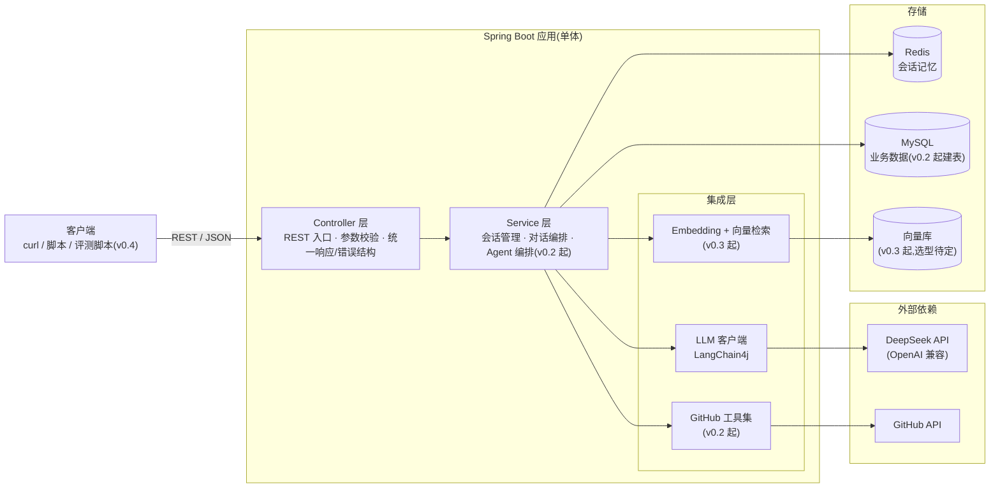
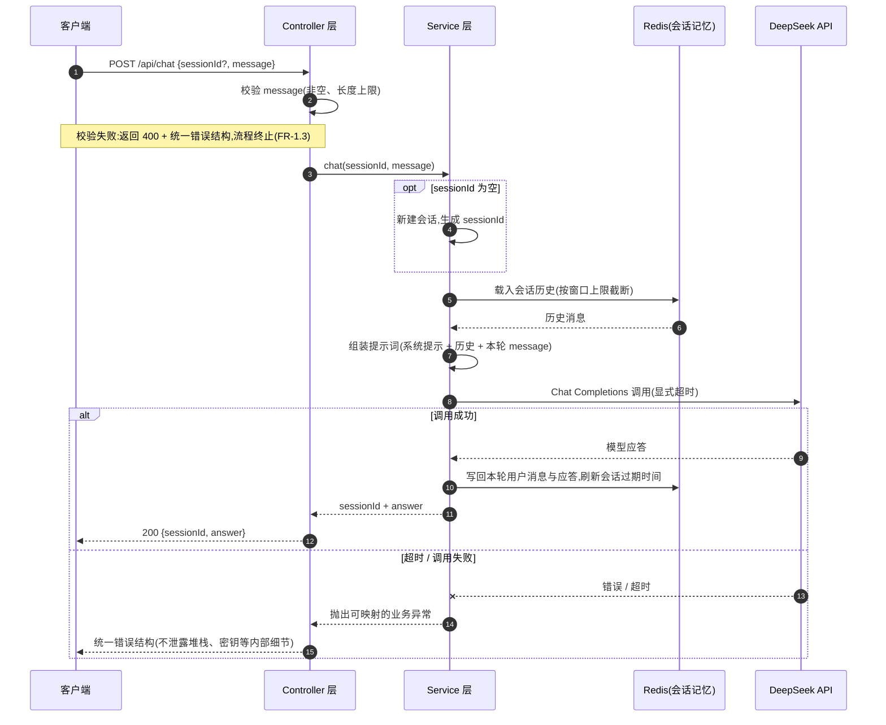

# repo-scout 概要设计文档

> 本文档为设计基线,随实现迭代更新。

- 版本:v0.1(设计基线)
- 日期:2026-07-26
- 状态:待评审
- 关联文档:[需求文档 requirements.md](requirements.md)

---

## 1. 概述

### 1.1 文档目的

本文档描述 repo-scout(GitHub 仓库导读 Agent)的总体架构、模块划分、关键数据流、存储设计与技术选型理由,作为 v0.1–v0.4 各迭代开发的设计基线:

- 固化跨迭代稳定的架构决策,让每期开发在同一张蓝图上做增量;
- 为当前迭代 v0.1 提供可直接对照开发的分层职责与数据流说明;
- 记录技术选型的取舍理由。

实现细节(具体包名、类名、Redis 键名格式等)不在本文约束范围内,由实现时确定;文中尚无法确定的决策一律标注「待定」,不提前拍板。

### 1.2 读者

- 本项目开发者(含并行开发骨架代码的协作方):按本文的分层与职责落地代码;
- 架构评审人:检查设计与需求的一致性;
- 学习 Spring Boot 3 + LangChain4j 构建 Agent/RAG 应用的工程师(见需求文档「给谁用」)。

### 1.3 与需求文档的关系

- [requirements.md](requirements.md) 回答「做什么」:按 FR 编号定义功能需求,按 v0.1–v0.4 划分迭代。本文回答「怎么做」,全程引用 FR 编号,不重复需求内容。
- 需求文档的非功能需求(超时、成本、错误处理、安全)在本文第 7 节收敛为设计约束。
- 两文档如有矛盾,以 requirements.md 为准,并应尽快修订本文消除矛盾。

---

## 2. 架构总览

### 2.1 目标架构(v0.4 完整形态)

repo-scout 是单体 Spring Boot 应用,对外只暴露 REST API(一期无前端)。应用内部分三层:Controller 层负责协议与校验,Service 层负责会话管理与编排,集成层封装对大模型、GitHub 与向量检索的访问。外部依赖为 DeepSeek API 与 GitHub API;存储按职责分离:MySQL 存业务数据、Redis 存会话记忆、向量库存文档向量。

图中标注版本的组件在对应迭代才引入;未标注版本的部分自 v0.1 起存在。

### 2.2 演进说明

各迭代在同一架构上做增量,不推翻前期结构:

| 迭代 | 新增内容 | 架构上的变化 | 对应 FR |
| --- | --- | --- | --- |
| v0.1 | 项目骨架、DeepSeek 接入、基础对话 API、会话记忆 | 只有「对话链路 + Redis 记忆」:Controller → Service → LLM 客户端 → DeepSeek,记忆读写 Redis;MySQL 仅配置连接、不建表 | FR-1.1 ~ FR-1.4 |
| v0.2 | 仓库接入、GitHub 工具集、Agent 自主规划(Function Calling) | 新增 tools 模块与 GitHub API 依赖;MySQL 开始存仓库记录;Service 层扩展出 Agent 编排 | FR-2.1 ~ FR-2.3 |
| v0.3 | 文档向量化、RAG 问答、仓库分析报告 | 新增 rag 模块、进程内 Embedding(`bge-small-zh`)与向量库 | FR-3.1 ~ FR-3.3 |
| v0.4 | 效果评估、Docker 部署、文档收尾 | 应用架构不变;新增独立 Python 评测脚本(作为 API 客户端)与 Docker/Compose 交付物 | FR-4.1 ~ FR-4.3 |

---

## 3. 模块划分与分层职责

以下为逻辑模块划分:v0.1 模块写到职责粒度,v0.2/v0.3 模块只给概要,进入对应迭代前再细化。具体包名、类名以骨架代码实现为准,本文不做约束。

### 3.1 controller(v0.1,详)

- REST 入口:承接 `GET /api/health`(FR-1.1)、`POST /api/chat`(FR-1.3)等接口,只做协议转换,不含业务逻辑。
- 参数校验:`message` 非空、长度上限(FR-1.3;长度上限同时服务于成本控制约束),校验失败返回 400 与可读错误信息。
- 统一响应/错误结构:对外统一「错误码 + 人类可读信息」的错误响应,按错误类别映射 HTTP 状态码(参数错误 4xx、外部依赖失败、内部错误 5xx),不向客户端泄露堆栈与密钥(FR-1.3,错误处理原则)。

### 3.2 service(v0.1,详)

- 会话管理:`sessionId` 为空时新建会话并在响应中返回;会话彼此隔离,上下文互不串扰(FR-1.3、FR-1.4)。
- 对话编排:载入记忆 → 组装提示词 → 调用模型 → 写回记忆的主流程(FR-1.2 ~ FR-1.4,详见第 4 节)。

### 3.3 config(v0.1,详)

- 数据源装配:MySQL 连接配置(v0.1 仅连接,不建表)。
- Redis 装配:连接配置与会话记忆参数(窗口上限、过期时间,均可配置,FR-1.4)。
- LangChain4j 模型客户端装配:DeepSeek base-url、模型名、超时等均可配置(FR-1.2);API Key 等敏感配置仅通过环境变量注入(FR-1.1,安全约束)。

### 3.4 tools(v0.2,概要)

GitHub 工具集:目录树、README、issues 列表(可按状态过滤)、最近 commits 四类工具(FR-2.2),以 Function Calling 方式暴露给 Agent 自主选用(FR-2.3);统一处理 GitHub API 限流与网络失败的重试/降级。进入 v0.2 前细化。

### 3.5 rag(v0.3,概要)

文档切分与 `bge-small-zh` 向量化入库(FR-3.1)、相似度检索与上下文注入(FR-3.2),支撑 RAG 问答与仓库分析报告(FR-3.3)。进入 v0.3 前细化。

---

## 4. 关键数据流:v0.1 一次对话请求

对应 FR-1.2 ~ FR-1.4。

要点说明:

- 主路径:校验通过后,`sessionId` 为空则新建会话;从 Redis 载入历史时按窗口上限截断,避免提示词无限膨胀(FR-1.4,成本控制);调用成功后将本轮用户消息与模型应答写回 Redis 并刷新会话过期时间,最终返回 `{sessionId, answer}`(FR-1.3)。
- 失败路径一(参数错误):`message` 为空或超长时,Controller 层直接返回 400 与可读错误信息,不进入业务流程(FR-1.3)。
- 失败路径二(外部依赖失败):DeepSeek 调用超时或出错时,由显式超时兜底,映射为统一错误结构与相应状态码,不向客户端泄露内部细节;服务端日志记录失败上下文(不含敏感信息)以便排查(FR-1.3,错误处理原则)。

---

## 5. 存储设计

### 5.1 Redis:会话记忆(v0.1 起)

对应 FR-1.4:

- 定位:存放各会话的多轮消息历史。存 Redis 而非进程内,保证服务重启后同一 `sessionId` 的上下文仍在。
- 键组织:按 `sessionId` 组织,一个会话对应各自独立的键,天然保证不同会话上下文互不串扰;具体键名格式与消息序列化方式「待实现时定」。
- 窗口上限:记忆设窗口上限(按消息条数或 token 数),超出后按策略截断;上限可配置。
- 过期策略:每个会话设置过期时间(TTL),每次写回时刷新,过期后由 Redis 自动清理;过期时间可配置。

### 5.2 MySQL:业务数据

- v0.1:仅完成数据源连接配置(FR-1.1),不建任何表。
- v0.2 起:存放仓库接入记录等业务数据(FR-2.1),表结构进入 v0.2 时细化。

### 5.3 向量库:文档向量(v0.3 起)

- 存放仓库文档切分、向量化后的文档块,支持按相似度检索(FR-3.1、FR-3.2)。
- 具体选型「待定」,进入 v0.3 前细化。

---

## 6. 技术选型与理由

### 6.1 Spring Boot 3 + LangChain4j

- Spring Boot 3 是 Java 服务端的事实标准:分层工程结构、配置外部化、健康检查等能力开箱即用,与本项目目标读者(Java 后端开发者)的技能栈一致。
- LangChain4j 是 Java 圈主流的 LLM 应用框架,对本项目的关键价值在于一个框架覆盖全部迭代的能力台阶:模型客户端抽象(v0.1 对话)、会话记忆抽象(v0.1 记忆)、工具调用支持(v0.2 Function Calling)、Embedding 与向量检索组件(v0.3 RAG),逐迭代渐进启用即可,不需要中途换框架或自研胶水层。
- 模型经统一抽象接入,后续如更换模型供应商,改动集中在配置与装配层,不侵入业务代码。

### 6.2 DeepSeek API(OpenAI 兼容)

- 成本低:token 单价便宜,个人项目也承受得起高频调试与 v0.4 批量评测的消耗。
- 国内直连:无需代理即可访问,网络延迟与稳定性可控。
- OpenAI 兼容协议:LangChain4j 可直接以 OpenAI 兼容方式接入(FR-1.2),无需专用 SDK;后续更换其他兼容协议的模型,迁移成本也低。
- 支持 Function Calling:这是 v0.2 Agent 自主规划调用工具(FR-2.3)的前提能力。

### 6.3 进程内 ONNX Embedding(`bge-small-zh`)

- 前提:DeepSeek 不提供 embedding 接口,向量化必须另寻方案。
- 进程内 ONNX 推理零外部 API 成本,也免去独立部署一套 embedding 服务的运维负担,与非功能需求「Embedding 不产生外部 API 费用」的成本约束一致。
- `bge-small-zh` 面向中文语义检索,模型体积小、CPU 即可推理,匹配个人项目的资源规模;LangChain4j 对该模型有现成的进程内集成。

### 6.4 MySQL + Redis:按数据职责分离

- MySQL 存业务数据:仓库记录等需要持久保存、结构化查询的数据(v0.2 起)。
- Redis 存会话记忆:会话上下文是热数据——读写频繁、天然有生命周期(过期即弃)、丢失可接受(重开会话即可),Redis 的 TTL 机制直接实现 FR-1.4 的过期策略,读写性能也优于关系库。
- 两类数据的生命周期与访问模式差异明显,分开存放各取所长,避免用单一存储勉强兼顾。

### 6.5 一期无前端

- 一期预算与时间集中在 Agent 能力(工具调用、RAG、评估)上,这是本项目的核心展示点;前端不构成关键路径。
- REST API 用 curl/脚本即可演示与验收,v0.4 的评测脚本也直接面向 API,无前端不阻塞任何验收标准。

### 6.6 Python 评测脚本

- 评估以外部观察者身份独立于服务端进程运行,只依赖公开 REST API,不与服务端代码耦合;同一评测集可横向对比不同版本/参数的效果(FR-4.1)。
- Python 在批量 HTTP 调用、评分统计与报告汇总上生态成熟、脚本成本低。
- 顺带让项目覆盖 Java + Python 双语言实践。

---

## 7. 设计约束

以下约束源自需求文档的[非功能需求](requirements.md#d-非功能需求),对所有迭代的设计与实现生效;此处只列要点,细节以需求文档为准:

- **显式超时**(响应时间预期):所有外部调用(DeepSeek、GitHub)必须设置显式超时,不允许无限等待;重型任务(如分析报告)的接口设计需考虑异步或明确的超时策略。
- **成本控制**(API 调用成本控制):会话记忆设窗口上限;工具返回内容注入提示词前做裁剪;Agent 单次问答的工具调用轮数设上限;用户消息长度设上限;记录 token 用量。
- **统一错误结构**(错误处理原则):错误码 + 人类可读信息,按类别映射 HTTP 状态码,不泄露堆栈与密钥;检索不到依据时承认「不知道」,不编造。
- **一期无鉴权、仅内网**(安全与鉴权范围):v0.1–v0.4 不做认证鉴权,仅用于本地/内网演示,不暴露公网;对外开放前必须先补鉴权方案。
- **敏感配置仅环境变量**(安全与鉴权范围):API Key、数据库/Redis 口令等仅通过环境变量注入,不写入代码、明文配置或仓库,日志与错误响应中不得输出。
